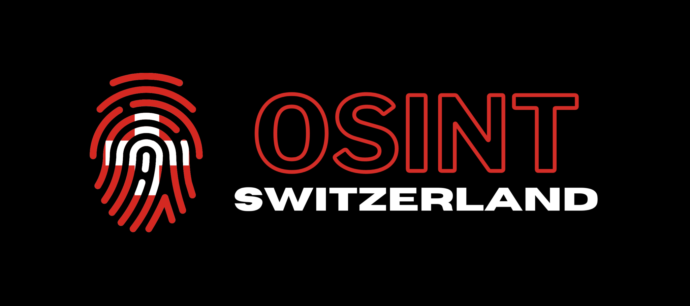
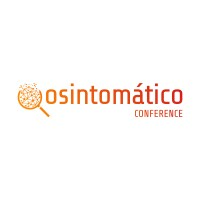
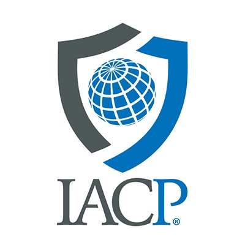
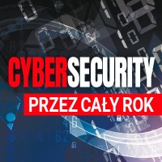
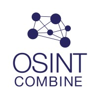

# OSINT Conferences and meetups

In this repository, you will find a list of OSINT conferences and meetups that have taken place in various countries over the past couple of years.

|  Icon         | Name            | Link             | Country     |  Next date /  Last date     |  Social Media  | 
|:------------------:|------------------|-------------------------|-------------|-------------|-------------|
||OSINTifyCon|https://osintifycon.com/|Online|5 Febrary 2026|[Linkedin](https://www.linkedin.com/company/osintifyconf/)|
||OSINTCon|https://osintconference.com/|Online|01 November 2025|[Linkedin](https://www.linkedin.com/company/osintcon/)|
||OSCON|https://osintswitzerland.ch/events/oscon25/|Switzerland|14 November 2025|[Linkedin](https://www.linkedin.com/company/osint-switzerland/posts/)|
||OsintTomatico|https://2025.osintomatico.com/|Spain|01 May 2026|[Linkedin](https://www.linkedin.com/company/osintomatico/)|
||Global Investigave Journalism Conference|https://gijn.org/global-conferences/|Malaysia|10 November 2025||
||SANS OSINT SUMMIT|https://www.sans.org/cyber-security-training-events/sans-osint-summit-2026|USA|16 March 2026|[Linkedin](https://www.linkedin.com/company/sans-institute/)|
||SANS OSINT SUMMIT EUROPE|https://www.sans.org/cyber-security-training-events/osint-amsterdam-2026|Netherlands|15 June 2026|[Linkedin](https://www.linkedin.com/company/sans-institute/)|
||Defcon Recon Village | https://reconvillage.org/cfp |USA|6 August 2026|[Linkedin](https://www.linkedin.com/company/reconvillage/)|
||OSMOSISCON|https://osmosisassociation.org/home/osmosiscon-2026/|USA|31 May 2026|[Linkedin](https://www.linkedin.com/company/osmosis-association/)|
||IntelSummit|https://intelsummit.org/|USA|01 September 2025|[Linkedin](https://www.linkedin.com/company/intelligence-and-national-security-alliance/)|
||IACP|https://www.theiacpconference.org/|USA|24 October 2026|[Linkedin]()|
||The GEOINT Symposium|https://usgif.org/geoint-symposium-2026/|USA|03 May 2026|[Linkedin](https://www.linkedin.com/company/united-states-geospatial-intelligence-foundation-usgif-/)|
||Layer8|https://layer8conference.com/|USA|05 June 2025|[Twitter](https://x.com/layer8con)|
||UK OSINT Community Meetup|https://www.osint.uk/events|United Kingdom|04 March 2026|[Linkedin](https://www.linkedin.com/company/osintuk/posts/)|
||OSINTerdam||Netherlands|20 July 2024|[Linkedin](https://www.linkedin.com/company/osinterdam/) [Twitter](https://x.com/OSINTerdam)|
||OSINT-FR meetup|https://osintfr.com/meetup/|France|Various/Multiple|[Linkedin](https://www.linkedin.com/company/osintfr/)|
||OSINT Shadows Conference|https://en.osintshadows.pl/|Poland|26 March 2026|[Linkedin](https://www.linkedin.com/showcase/cybersecurityprzezcalyrok/)|
||Australian OSINT Symposium|https://www.osintsymposium.com/|Australia|01 September 2026|[Linkedin](https://www.linkedin.com/company/osintcombine/)|
||Osint & Cachaça||Brazil|30 December 1899|[Linkedin](https://www.linkedin.com/showcase/osintecacha%C3%A7a/about/)|
||German OSINT Conference (GOSINTCon)|https://gosintcon.de/|Germany|15 June 2026|[Linkedin](https://www.linkedin.com/company/german-osint-conference/people/)|
||Japan OSINT Conference  |https://osint.jp/2026 |Japan|17 Octoner 2026|[Twitter](https://x.com/osintjapan)|

If you want to add an OSINT conference or meetup, feel free to request that it be added to this repository!

Use Issues or the contact details on the main page of Ubikron's Github profile.

## Our other repositories

[Ubikron Advanced Enrichments](https://github.com/ubikron/Advanced-Enrichments)  
[Awesome AI OSINT](https://github.com/ubikron/Awesome-AI-OSINT)  
[Awesome OSINT Chrome Extensions](https://github.com/ubikron/awesome-osint-chrome-extensions)  
[OSINT People](https://github.com/ubikron/OSINT-People)  
[OSINT Companies](https://github.com/ubikron/OSINT-Companies)  
[OSINT CTFs](https://github.com/ubikron/OSINT-CTFs)  
[OSINT Newsletters](https://github.com/ubikron/OSINT-newsletters)  
[OSINT Books](https://github.com/ubikron/OSINT-Books)  

-----

Don't miss our updates!   
[Linkedin](https://www.linkedin.com/company/ubikron/)    
[YouTube](https://www.youtube.com/@ubikron)  
